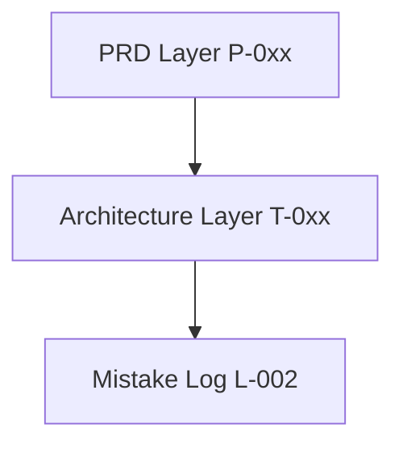

# BeeMail Neural Memory Layer

## Master Index

| ID | Title | Tags | Importance |
|---|---|---|---|
| K-001 | Core Identity | [identity] | 10 |
| K-002 | Webmail Context | [context] | 8 |
| R-001 | User Experience | [ux] | 7 |
| R-002 | Competitive Landscape | [market] | 5 |
| X-001 | Security and API Keys | [security] | 10 |
| X-002 | Data Persistence Risks | [data] | 9 |
| T-001 | System Architecture | [architecture] | 10 |
| T-002 | Realtime Sync Matrix | [sync] | 9 |
| T-003 | Fallback Protocol | [fallback] | 8 |
| D-001 | Active Decisions | [decisions] | 9 |
| D-002 | Tradeoffs Archive | [decisions] | 6 |
| L-001 | Telemetry & Feedback | [metrics] | 5 |
| L-002 | Mistakes & Regressions | [bugs, learning] | 10 |
| P-001 | Product Requirements | [prd] | 9 |
| P-002 | Functional Specs | [prd] | 8 |
| P-003 | Milestone Roadmap | [prd] | 7 |

## Knowledge Graph

